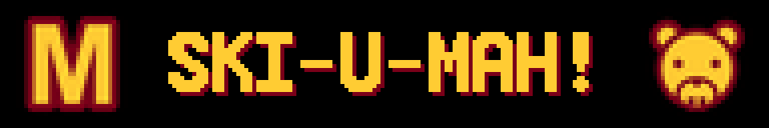

# Go Gophers

A Minnesota gameday sign for your panel: the block M, a message of your
choosing, and Goldy Gopher, in true maroon and gold.

Static by design — there is no feed to wait on and nothing to configure
before it looks right. Set it once and leave it up all season.

## Configuration

- **Message** — the text between the M and Goldy. Defaults to `SKI-U-MAH!`.
  Keep it uppercase; the panel fonts have no lowercase.
- **Maroon** — the block M and outline color. Defaults to `#7A0019`.
- **Gold** — the message and Goldy color. Defaults to `#FFCC33`.

Built for the [GLANCE Developer Network](https://github.com/glance-led-dev/glance-dev-network).
