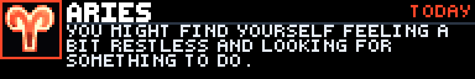

# Horoscope

Horoscope is a Glance Scroll Lifestyle app by reyos86. It shows a daily vibe for the zodiac signs you pick: original pixel glyph, sign name, and a short punchline from the day’s reading.



## Preview

From the GLANCE Developer Network repository:

```powershell
pip install -e .
gdn studio apps/horoscope
```

Or:

```powershell
gdn preview apps/horoscope
gdn render apps/horoscope --input "sign1=leo" --input "sign2=virgo"
gdn validate apps/horoscope
```

If `gdn` is not on `PATH`, use `python -m gdn.cli` instead.

## Configuration

Phone-friendly dropdowns (tap to pick — no Ctrl-click):

| Setting | Default | Notes |
|---------|---------|--------|
| **Sign 1** | `aries` | Always shown |
| **Sign 2** | `none` | Optional |
| **Sign 3** | `none` | Optional |
| **Sign 4** | `none` | Optional |

Leave 2–4 as `none` if you only want one horoscope — the app stays a **single page**, so the playlist never pads with duplicates.

With more than one sign filled in, the panel rotates which sign is shown on each refresh (`#2/3`, etc.).

## Pages

| Page | Contents |
|------|----------|
| **main** | Glyph, sign name, `TODAY` (or `#n/total` when multiple), opening punchline |

Panel size is **192×32**. Refresh is **120** seconds (so multi-sign lists can advance). API responses are cached with a **6-hour** HTTP TTL.

## Data source

[Free Horoscope API](https://freehoroscopeapi.com/) daily endpoint:

```text
https://freehoroscopeapi.com/api/v1/get-horoscope/daily?sign={sign}
```

No API key. GDN fetches server-side (browser CORS does not apply). A `User-Agent` header is required — bare clients can receive HTTP 403.

The full API essay is shortened to an opening punchline for LED readability.

## Features

- Up to 4 signs via simple dropdowns (works on mobile)
- One playlist page — single-sign installs are not forced through empty frames
- Unique bright glyph art per sign
- Graceful offline / API failure screen (`HOROSCOPE` / `UNAVAILABLE`)

## Assets

Each sign has a lowercase PNG in `assets/` (`aries.png` … `pisces.png`), drawn with `c.image`. Icons keep classic glyph shapes, scaled and recolored with a unique bright palette per sign.

## Errors

When the API is down or returns empty data, the panel shows the sign name plus `HOROSCOPE` / `UNAVAILABLE` (or `NO DATA`). It does not invent fake readings.

## Known limitations

- Depends on a third-party free API (availability and wording can change)
- Shows a punchline, not the full daily essay
- Multi-sign rotation advances on the refresh timer (not every ~3s playlist flip) — GDN page lists are fixed at publish time, so this keeps single-sign installs to one frame
- Daily only in this milestone

Built for the [GLANCE Developer Network](https://github.com/glance-led-dev/glance-dev-network).
