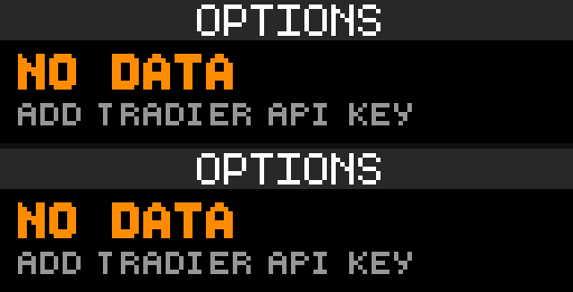

# Options Board

Options Board is a GLANCE finance app by reyos86. It shows nearest-expiry at-the-money (ATM) call and put quotes for a U.S. options underlier via Tradier live, plus expected move, chain call/put volume bias, a session tag, and an ATM±1 wings page.



## Preview

From the GLANCE Developer Network repository:

```powershell
pip install -e .
gdn studio apps/market-options
```

The browser-only preview is also available with:

```powershell
gdn preview apps/market-options
```

If the `gdn` executable is not on `PATH`, use `python -m gdn.cli` in its place.

## Configuration

- **Tradier API token** — live brokerage Bearer token from [web.tradier.com/user/api](https://web.tradier.com/user/api). Required. Sandbox is not supported.
- **Ticker** — `SPY`, `QQQ`, `IWM`, `AAPL`, `TSLA`, `NVDA`, `META`, `AMD`, or `OTHER`.
- **Custom ticker** — used only when Ticker is `OTHER`. Type any U.S. options underlier (for example `MSFT`). Empty custom falls back to `SPY`.

## Pages

| Page | Contents |
|------|----------|
| **board** | Symbol and spot, optional session tag, day change %, expiry, expected move (`EM+/-`), chain volume tag (`C VOL` / `P VOL` / `BAL`), and ATM call/put mid plus bid–ask. |
| **wings** | Same top bar, then ATM−1 / ATM / ATM+1 strike columns with call and put mids. Shows `NO WINGS` when neighboring strikes are unavailable. |

Panel size is **128×32**. Refresh is **300 seconds** (5 minutes) because options chains are heavy.

## Data source

All quotes and chains come from **Tradier live** (`https://api.tradier.com/v1`):

- Market quotes for the underlier
- Option expirations (nearest listed expiry only)
- Option chain for that expiry (with greeks requested; IV/OI are not drawn on the panel)

Requests use `Authorization: Bearer <token>`.

## Display behavior

- **ATM strike** — closest listed strike to spot on the nearest expiry.
- **Expected move** — near-dated ATM straddle approximation: call mid + put mid, shown as `EM+/-`.
- **Volume tag** — sums call vs put volume on that nearest-expiry chain. `C VOL` or `P VOL` when one side exceeds the other by 25%; otherwise `BAL`.
- **Session tag** — derived from panel UTC time converted to U.S. Eastern (approximate DST): blank in RTH, otherwise `PRE`, `AH`, `ON`, or `CLOSED`. Suppressed when it would collide with the day-change percentage.
- **Money formatting** — options and EM show cents under $100 and whole dollars at/above $100; spot always shows two decimals.

## Errors and empty states

Both pages share labeled error screens when data cannot be loaded, including:

- Missing key → `NO DATA` / `ADD TRADIER API KEY`
- Bad auth → `BAD TOKEN` / `CHECK TRADIER KEY`
- Rate limit on quotes → `RATE LIMITED` / `TRY AGAIN LATER`
- Bad symbol, missing price, no expiries, no chain, or no ATM pair → matching short titles such as `BAD SYMBOL`, `NO PRICE`, `NO EXPIRIES`, `NO CHAIN`, or `NO ATM`

Command-line example:

```powershell
gdn render apps/market-options --input "symbol=SPY" --input "apikey=YOUR_TOKEN"
gdn validate apps/market-options
```

## Current technical limitations

- Live Tradier only; there is no sandbox/environment toggle.
- Only the **nearest** listed expiry is used.
- Session DST uses a month/day approximation, not a full holiday calendar.
- Quote rate-limit handling is applied on the quotes request; expiry/chain calls rely on normal HTTP status handling.
- The app draws still frames on the refresh timer; it does not animate.

## Changelog

See [CHANGELOG.md](CHANGELOG.md) for version history.

Built for the [GLANCE Developer Network](https://github.com/glance-led-dev/glance-dev-network).
