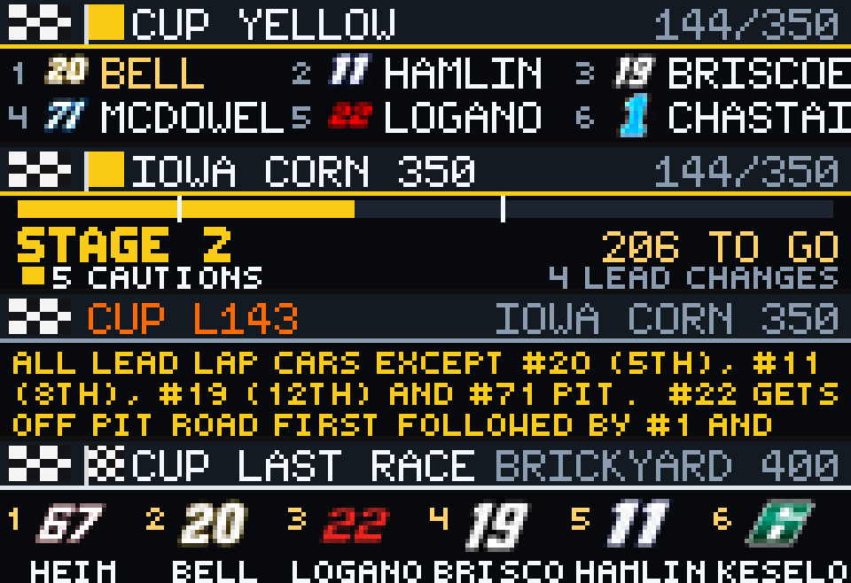

# NASCAR Companion

NASCAR Companion is a GLANCE sports app by reyos86. It follows Cup, O’Reilly Auto Parts, or Trucks with a live race board, last-race results, lap/stage/flag (or practice/qual) progress, and rotating race updates from NASCAR’s public Content Feed.



## Preview

From the GLANCE Developer Network repository:

```powershell
pip install -e .
gdn studio apps/nascar-companion
```

The browser-only preview is also available with:

```powershell
gdn preview apps/nascar-companion
```

If the `gdn` executable is not on `PATH`, use `python -m gdn.cli` in its place.

## Configuration

- **Series** — `CUP`, `OREILLY`, or `TRUCKS` (default `CUP`). Chooses which national series schedule and live feed to follow (Cup, O’Reilly Auto Parts, Trucks). The code still accepts a legacy `XFINITY` alias and maps it to the same series ID / `ORL` short label.

## Pages

Manifest order: `upcoming`, `race`, `updates`, `results`.

| Page | Contents |
|------|----------|
| **upcoming** | Next unfinished race. Before green: race name, track, scheduled laps, date, and a waiting note. Once live: top-6 leaderboard (position, small car badge, last name). |
| **race** | Lap progress bar (flag-colored; stage ticks during race sessions), session or stage/flag label, laps to go / finish / track, plus caution and lead-change counts. Practice and qualifying prefer `PRACTICE` / `QUAL` labels so they do not read as a green flag. |
| **updates** | One race ticker note at a time, rotating among recent notes (about once per minute). |
| **results** | Most recent finished race only (`PREVIOUS RACE`). Top six finishers with large car badges and short names. Never shows an in-progress race. |

Panel size is **192×32**. Refresh is **60 seconds**. Series chrome labels: `CUP`, `ORL`, `TRK`.

## Data source

Public NASCAR Content Feed CDN (`cf.nascar.com`):

- Season schedule (`race_list_basic.json`)
- Live / results feed per series and race
- Lap notes and live flag comments for the updates page

No API key is required. Availability depends on NASCAR’s public CDN.

## Display behavior

- **Live board** — top six by running position; last names only; P1 name highlighted.
- **Driver names** — last token after stripping leading `*`, `#` markers, and `(…)` suffixes (rookies / part-timers) so the board shows a clean last name.
- **Flags** — bundled icons for green, yellow, red, white, blue (warmup), and checkered; chrome accent follows flag color when live.
- **Sessions** — on the race page, practice/qualifying show `PRACTICE` or `QUAL` and the track name; race sessions show stage or flag plus laps to go when available.
- **Car badges** — bundled art for the car numbers listed in `manifest.yaml` (including `00`, `8`, `18`, and `39`), full size on results and small on the live board. Missing numbers fall back to a manufacturer-colored number plate.
- **Race progress** — fill by lap fraction during race sessions; stage ticks from stage lengths in the feed; finished when laps to go are done or the flag is checkered/finish.
- **Updates** — wrapped note text; color hints for yellow/red/checkered-related notes.

## Assets

Runtime assets under `assets/`:

- Checkered chrome and flag icons (`flag-green`, `flag-yellow`, `flag-red`, `flag-white`, `flag-blue`, `flag-checkered`)
- Car badge pairs (`car-N.png` and `car-N-sm.png`) for every number listed in `manifest.yaml`

Catalog previews: `preview/upcoming.png`, `preview/race.png`, `preview/updates.png`, `preview/results.png`, and `preview/preview.png`.

## Errors and empty states

- Schedule failure → `SCHEDULE ERROR`
- No race to show → `NO RACE`
- Live field not ready → `WAITING ON FIELD` / waiting-for-green notes
- No finished results → `NO RESULTS`
- No ticker notes → `NO UPDATES YET` / `CHECK BACK NEAR GREEN`

If the live feed for the next race is not unlocked yet, **upcoming** keeps the static next-race card; **race** / **updates** can fall back to the previous race where appropriate.

Command-line example:

```powershell
gdn render apps/nascar-companion --input "series=CUP"
gdn render apps/nascar-companion --input "series=OREILLY"
gdn validate apps/nascar-companion
```

## Current technical limitations

- Series choices in settings are Cup / O’Reilly / Trucks (`XFINITY` remains a code-level legacy alias).
- Boards show the **top six**, not the full field; gap formatting exists in code but is not drawn on the live upcoming board.
- Car art covers the manifest number list; other cars use number plates.
- Driver names are last-name only and truncated for space.
- Updates rotate on a one-minute cadence; the panel does not scroll or animate between refreshes.
- Relies on public CF JSON and race IDs from the basic schedule.

Built for the [GLANCE Developer Network](https://github.com/glance-led-dev/glance-dev-network).
