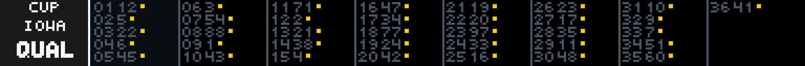

# NASCAR Scoring Pylon

NASCAR Scoring Pylon is a GLANCE sports app by reyos86. It shows a full-field running order for Cup, O’Reilly Auto Parts, or Trucks on a wide panel, with flag-colored header status and ticks for pits, DVP, garage/repair, fastest lap, and lead-lap separation.



## Preview

From the GLANCE Developer Network repository:

```powershell
pip install -e .
gdn studio apps/nascar-pylon
```

The browser-only preview is also available with:

```powershell
gdn preview apps/nascar-pylon
```

If the `gdn` executable is not on `PATH`, use `python -m gdn.cli` in its place.

## Configuration

- **Series** — `CUP`, `OREILLY`, or `TRUCKS` (default `CUP`). Selects which national series schedule and live feed to follow (Cup, O’Reilly Auto Parts, Trucks). The code still accepts a legacy `XFINITY` alias and maps it to the same series ID / `ORL` short label.

## Pages

| Page | Contents |
|------|----------|
| **pylon** | Full running order in columns: car numbers with status ticks, plus a left header for series, session/stage, and laps to go (or `FINISHED`). |

Panel size is **384×32** (Scroll). Refresh is **60 seconds**. Series labels: `CUP`, `ORL`, `TRK`.

## Data source

Public NASCAR Content Feed CDN (`cf.nascar.com`):

- Season schedule (`race_list_basic.json`, cached about one hour)
- Live / results feed for the selected series and race (shorter TTL while active)

No API key is required.

**Race selection:** prefer the next unfinished race’s live feed; if that is unavailable, fall back to the most recent finished race.

## Display behavior

- **Field layout** — cars sorted by running position, packed into columns (about five cars per column). The top-five column is highlighted. Overflow beyond panel width is dropped.
- **Position moves** — car number green for gains and red for losses (from feed differentials when present); P1 gold when unchanged.
- **Pit tick (blue)** — recent pit within the last five leader laps; omitted when the car is out or repairing.
- **DVP tick (orange)** — car is on Damaged Vehicle Policy.
- **Garage / repair** — yellow tick for garage or off-track (not retired); retired cars get a red DNF-style tick and muted numbers.
- **Fastest lap (purple)** — lowest positive last-lap time among cars still on track / in pits.
- **Lead lap** — soft cut before the first car a lap or more down; lapped cars use muted grey numbers.
- **Header** — series short name plus session context. Practice/qualifying show `PRACTICE` / `QUAL` (with short track name when space allows) so those sessions do not read as a green-flag race; race sessions show stage and laps to go. Accent color follows flag state when known.

No bundled car images — the pylon is number-and-tick typography only.

## Errors and empty states

- Schedule failure → `SCHEDULE ERROR` / `CF {status}`
- Nothing to show → `NO RACE` (with reason such as no finished race)
- Results feed failure → `NO RESULTS`
- Empty vehicle list → `NO FIELD`

Command-line example:

```powershell
gdn render apps/nascar-pylon --input "series=CUP"
gdn render apps/nascar-pylon --input "series=OREILLY"
gdn validate apps/nascar-pylon
```

## Current technical limitations

- Series choices in settings are Cup / O’Reilly / Trucks (`XFINITY` remains a code-level legacy alias).
- Position deltas are approximate from the feed; the app does not store prior refreshes.
- Field width is limited by the 384px panel; not every entry may fit.
- Status ticks depend on fields present in the live-feed JSON.
- Depends on public CF CDN availability.
- Frames are still images redrawn on the refresh timer.

Built for the [GLANCE Developer Network](https://github.com/glance-led-dev/glance-dev-network).
