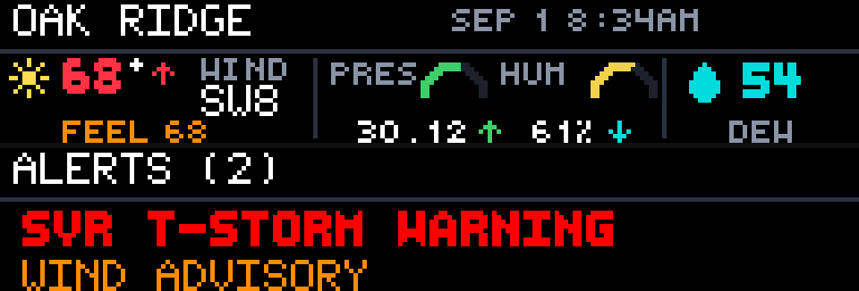

# PWS Dashboard

PWS Dashboard is a GLANCE weather app by reyos86. It shows live readings from a Weather Underground personal weather station, condition icons for the station location, and National Weather Service alerts for that same point.



## Preview

From the GLANCE Developer Network repository:

```powershell
pip install -e .
gdn studio apps/pws-station
```

The browser-only preview is also available with:

```powershell
gdn preview apps/pws-station
```

If the `gdn` executable is not on `PATH`, use `python -m gdn.cli` in its place.

## Configuration

- **Weather Underground API key** — free PWS contributor key from [wunderground.com/member/api-keys](https://www.wunderground.com/member/api-keys). Required.
- **Station ID** — your PWS ID (for example `KTXDALLAS123`). Find it on your Weather Underground station page.
- **Station name** — header label on the board (default `MY STATION`). Uppercase fits the bitmap fonts best; the header truncates to 12 characters.
- **Units** — `e` for imperial (°F, inHg, mph) or `m` for metric (°C, mb, km/h). Default `e`.

## Pages

| Page | Contents |
|------|----------|
| **station** | Station label, observation time, condition icon, temperature with trend, wind (cardinal + speed), feels-like, pressure gauge with value and trend, humidity gauge with trend, and dew point. |
| **alerts** | Header `ALERTS` (with count when active). Up to two event titles on screen from up to three fetched alerts, prioritized WARNING → ADVISORY → WATCH → other. Empty → `ALL CLEAR` / `NO ACTIVE WARNINGS`. |

Panel size is **192×32**. Refresh is **300 seconds**.

## Data sources

- **Weather Underground / weather.com** — PWS current observation and ~1-day history for trends (`api.weather.com` PWS endpoints), using your API key and station ID.
- **The Weather Company currents** — location condition icon codes from station lat/lon (same API key).
- **Open-Meteo** — weather-code cross-check when modeled sky conditions are needed.
- **National Weather Service** — active alerts for the station’s latitude/longitude (`api.weather.gov`).

HTTP responses for these calls are cached on the order of five minutes.

## Display behavior

- **Temperature** — integer with degree mark; trend chevron vs roughly the last hour of PWS history.
- **Feels-like** — heat index when hot, wind chill when cold, otherwise air temperature (`FEEL`).
- **Wind** — eight-point cardinal plus integer speed.
- **Pressure / humidity** — arc gauges with numeric readouts and trends when history or WU pressure trend is available.
- **Condition icon** — derived from TWC icon code and Open-Meteo, with rain/snow forced when the station reports precip. Clear-night moon art uses local hour (late evening / early morning) rather than relying only on the vendor day/night flag.
- **Observation time** — from the station’s local obs timestamp when present; otherwise panel time.

Icons are procedural bitmaps in `app.star` (no image assets required at runtime).

## Errors and empty states

Labeled screens cover common failures:

- Missing key → `NO DATA` / `ADD WU API KEY`
- Missing station → `NO STATION`
- Auth failure → `BAD API KEY`
- Unknown station → `BAD STATION`
- Rate limit → `RATE LIMITED`
- Other WU/HTTP problems → `WU ERROR` or related `NO DATA` messages
- Alerts without lat/lon → `NO LOCATION`; NWS failure → `NWS ERROR`

If the station observation cannot be loaded, both pages share that error path.

Command-line example:

```powershell
gdn render apps/pws-station --input "station=KTXDALLAS123" --input "apikey=YOUR_KEY" --input "units=e"
gdn validate apps/pws-station
```

## Current technical limitations

- A Weather Underground API key that can call the weather.com PWS and observation endpoints is required.
- Sky icons are not read from PWS camera/hardware; they come from location weather services plus precip overrides.
- The alerts page shows at most two titles even when the header count is higher.
- Station label is truncated to 12 characters in the header.
- Frames are still images redrawn on the refresh timer.

Built for the [GLANCE Developer Network](https://github.com/glance-led-dev/glance-dev-network).
