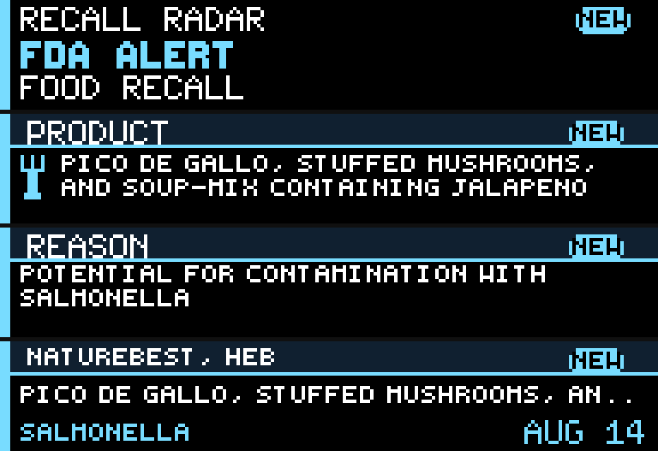

# Recall Radar

Recall Radar is a Glance Scroll news app by John McRae. It shows the newest recall from the official [FDA.gov Recalls, Market Withdrawals & Safety Alerts](https://www.fda.gov/safety/recalls-market-withdrawals-safety-alerts) table on a 192×32 panel. No API key is required.



The panel reads like a tiny recall wire: an alert header, the product, the reason, then brand, hazard, and date.

## Preview

From the Glance Developer Network repository:

```powershell
pip install -e .
gdn studio apps/recall-radar
```

Browser-only preview:

```powershell
gdn preview apps/recall-radar
```

If `gdn` is not on `PATH`, use `python -m gdn.cli` instead.

## Configuration

| Setting | Default | Notes |
|---------|---------|--------|
| **Category** | `ALL` | `ALL`, `FOOD`, `DRUGS`, or `DEVICES` |
| **Severity** | `ALL` | Kept for later class filters. Press notices are not classified yet. |

- **ALL** (category) — first row on the FDA.gov table (newest date, same order as the website).
- A single category keeps the first row whose product type is food, drugs, or devices.
- Severity does **not** switch to the older weekly Enforcement Report. That dump lags the website by about a week.

Panel size is **192×32**. Refresh is **1800 seconds**.

## Pages

| Page | Contents |
|------|----------|
| **alert** | Text-only identity frame: **RECALL RADAR**, **FDA ALERT**, category. Classified fallback rows show Class I/II/III. |
| **product** | Recalled product, fitted from the FDA.gov product description. |
| **reason** | Why it was recalled, in a small 3-line font so longer notices still fit. |
| **details** | Brand or firm, a product line, a short hazard, and the table date. |

## Display behavior

- Press-release rows are not classified. The panel labels those **FDA ALERT** (sky blue). It never invents Class I, II, or III.
- When the weekly Enforcement Report is used as fallback, official class labels and colors are:
  - Class I — red, full border
  - Class II — orange
  - Class III — yellow
- Color is a visual aid only. The wording remains the source of truth.
- Product and reason text are shortened only by taking the first useful phrase from the FDA fields, then wrapping or ellipsizing to fit. Meaning is not rewritten.
- Long header titles are clipped so they cannot run into **NEW** or the category label.
- **NEW** appears when the FDA table date (or enforcement `report_date`) is within **14 days** of now.

## Data sources

### Primary — FDA.gov recalls table

Same public list as [Recalls, Market Withdrawals & Safety Alerts](https://www.fda.gov/safety/recalls-market-withdrawals-safety-alerts). One `http.get`, no API key.

The page is already sorted by date descending. The app takes the first row that matches the selected category. A notice posted today — for example a NatureBest / H-E-B jalapeño recall — shows here even before it enters the weekly Enforcement Report.

Fields read from the table: date, brand name, product description, product type, recall reason, company name, and terminated flag.

### Fallback — openFDA Enforcement Report

Used only when the FDA.gov page is unreachable, or the first table page has no row for the selected category:

| Category | Endpoint |
|----------|----------|
| **Food** | `https://api.fda.gov/food/enforcement.json` |
| **Drugs** | `https://api.fda.gov/drug/enforcement.json` |
| **Devices** | `https://api.fda.gov/device/enforcement.json` |

openFDA is the weekly Recall Enterprise System dump. Its `last_updated` is typically several days behind FDA.gov.

When the fallback runs, each request uses `sort=report_date:desc` and `limit=5`. Among records that share the same `report_date`:

1. **Ongoing** is preferred over Terminated
2. Then the newest `recall_initiation_date`
3. Then Class I > II > III
4. Then `recall_number`

## Refresh and caching

- Panel **refresh**: 1800 seconds
- FDA.gov table **TTL**: 1800 seconds
- openFDA **TTL**: 3600 seconds

GDN caps uncached `http.get` calls at 8 per render. The default path uses 1 request. Cached responses are reused across the four pages.

## Errors and empty states

The panel always draws something:

- Network down / both sources fail → `FDA DATA UNAVAILABLE`
- No matching records → `NO MATCHING RECALLS` or `NO RECALLS FOUND`
- Missing product / reason / firm → `PRODUCT NOT LISTED`, `REASON NOT LISTED`, `FIRM NOT LISTED`

```powershell
gdn render apps/recall-radar --input "category=ALL"
gdn render apps/recall-radar --input "category=FOOD"
gdn render apps/recall-radar --input "category=DRUGS"
gdn render apps/recall-radar --input "category=DEVICES"
gdn validate apps/recall-radar
```

## Current technical limitations

- Fonts are **uppercase only**. Frames are **still images** (no scroll/animation); the next refresh shows new data.
- Outbound `http.get` times out at 4 seconds, does not follow redirects, and truncates bodies over 1 MB.
- FDA product descriptions and reasons are often long. The panel shows a fitted first portion, not the full record.
- The HTML table is the first page of the website. Older notices further down the pager are not fetched.
- This is **not** an official FDA application.

## Informational disclaimer

Recall Radar is informational. It is not medical advice, and it does not tell anyone to stop taking a medication or to discard a device. For what to do about a specific recall, use the official FDA notice and, when relevant, the manufacturer, a pharmacist, a doctor, or another appropriate professional.

Do not rely on this panel alone to decide whether a product is safe.

## Roadmap

Practical with the same official sources — **not built yet**.

- State filtering
- Keyword / brand / manufacturer watch
- Food-only allergen mode
- Pet-food recalls
- Baby-product / formula watch
- Newest 5 recalls rotation
- Recall count this week

## Accuracy

This app reports what FDA.gov published on the recalls table (and, if that page is down, what openFDA published from the Recall Enterprise System). It does not scrape news sites, social media, or third-party recall aggregators, and it does not use a model to decide whether something is recalled.

## Originality and attribution

The page structure and Starlark drawing code were created for this app. Recall facts come only from official FDA.gov and openFDA sources.

Built for the [Glance Developer Network](https://github.com/glance-led-dev/glance-dev-network).
