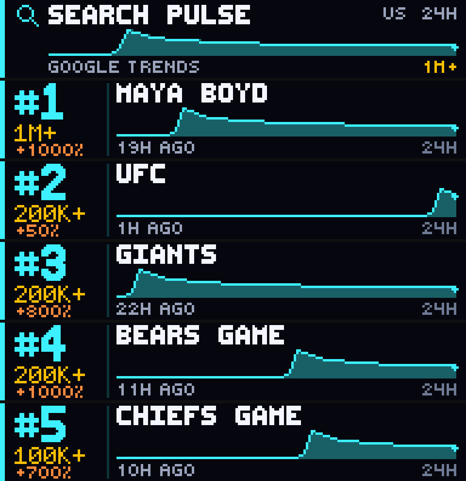

# Search Pulse

Search Pulse is a Glance Scroll news app by John McRae. It shows the **currently surging Google Search queries** from Google Trends **Trending Now** on a 192×32 panel. No API key is required.



These are **not** Google's overall or all-time most-searched queries. `#1` is the highest-volume Trending Now row for the selected country and time window, not the most-searched word on Google.

**Search Pulse is not affiliated with or endorsed by Google.**

## Preview

From the Glance Developer Network repository:

```powershell
pip install -e .
gdn studio apps/search-pulse
```

Browser-only preview:

```powershell
gdn preview apps/search-pulse
```

If `gdn` is not on `PATH`, use `python -m gdn.cli` instead.

## Configuration

| Setting | Default | Notes |
|---------|---------|--------|
| **Country** | `UNITED STATES` | `UNITED STATES`, `CANADA`, `UNITED KINGDOM`, `AUSTRALIA`, `MEXICO` |
| **Window** | `24 HOURS` | `4 HOURS` or `24 HOURS`. Maps to Google's `hours=` parameter. |
| **Accent color** | cyan `#3CF0FF` | Rank, left rail, magnifying glass, and sparkline. Volume stays amber. |

Country maps to Google's `geo=` parameter (`US`, `CA`, `GB`, `AU`, `MX`).

Panel size is **192×32**. Refresh is **600 seconds**. HTTP TTL is **600 seconds**, so every page of one render reuses a single feed fetch.

## Pages

| Page | Contents |
|------|----------|
| **pulse** | Search Pulse identity, Google Trends label, #1 sparkline, country, window, top volume |
| **one** … **five** | Rank, volume bucket, growth %, query, sparkline, start time |

## What it shows

| Field | Source | Panel |
|-------|--------|--------|
| Rank | Highest volume first | `#1` … `#5` |
| Query | Trending Now title | Fitted to one header line |
| Search volume | Google's bucket | `1M+`, `200K+`, `100K+`, … |
| Growth % | % growth vs. predicted baseline | `+1000%` when present |
| Started | On-page recency | `17H AGO` |
| Window | User dropdown | `4H` or `24H` |
| Graph | Start time + Active/Ended | Time-aligned surge sparkline |

Volume is displayed **exactly as Google publishes it**. `1M+` stays `1M+`. The app does not invent an exact count.

`+1000%` is Google's surge vs. its predicted baseline for that query — about 11× what they expected — not a share of all Google searches. The table often prints `+1000%` as the ceiling for the biggest spikes.

## Data source

Primary: the public Trending Now HTML table (the same page as [trends.google.com/trending](https://trends.google.com/trending?geo=US&hours=24&sort=search-volume)):

```text
https://trends.google.com/trending?geo=US&hours=24&sort=search-volume&hl=en-US
https://trends.google.com/trending?geo=US&hours=4&sort=search-volume&hl=en-US
```

The page includes a server-rendered table (`1M+ searches`, `+1000%`, Active, `17h ago`). Glance has no HTML parser; cells are read with string finds, then ranked by volume.

Fallback if that page times out or has no rows: official **Export → RSS feed**

```text
https://trends.google.com/trending/rss?geo=US
```

RSS is a small recency export (about 10 items, often `200+` / `500+`, no growth %). It does not honor the 4h/24h window and is not the main scoreboard.

- No authentication
- Direct `200`, no redirect
- HTML is ~1.6 MB (under GDN's 2 MB body cap); RSS is ~20 KB
- One HTML request per render, cached 10 minutes; RSS is only fetched if HTML fails
- `http.get` times out at 4 seconds, so a slow HTML fetch falls back to RSS

## Display behavior

- Query text is cleaned (common HTML entities, CDATA wrappers, a small accent map) then forced uppercase for the panel fonts.
- Fitting prefers one line in the largest readable font, then a smaller font, then truncation with `..`.
- Rank uses `10x16` (`#` is missing from `5x7`).
- The sparkline sits under the query (about 12px tall). X is the selected 4h or 24h window.
- If a title exists but volume is missing, the query still renders.

## Errors and empty states

- Network down / timeout / non-200 / empty body → `SEARCH PULSE` / `TREND DATA UNAVAILABLE`
- Fewer than 5 items → remaining pages show `NO TREND n` / `FEED HAS k`
- Unknown country input → United States feed

Command-line example:

```powershell
gdn render apps/search-pulse --input "country=UNITED STATES"
gdn render apps/search-pulse --input "window=4 HOURS"
gdn render apps/search-pulse --input "country=CANADA"
gdn validate apps/search-pulse
```

## Current technical limitations

- The full `1M+` / `100K+` board comes from the public HTML table, not RSS. Class-free markers (` searches</div>`, `Active`, `%`) can still change if Google restyles the page.
- HTML is large (~1.6 MB) and `http.get` times out at 4 seconds. A slow fetch falls back to the low-volume RSS slice.
- GDN Starlark has **no XML/XPath module** and **no regex**. Tags are read with string finds.
- GDN **does not follow HTTP redirects**.
- Fonts are **uppercase only**. Frames are **still images** (no scroll/animation).
- Outbound `http.get` caps uncached calls at 8 per render and truncates very large bodies.
- Accented letters are folded to ASCII so they can draw on the panel.
- Google does not put Explore time-series samples in the public HTML. This app does **not** call private Google endpoints for those.

## Roadmap

Practical with the same public page — **not built yet**.

- Additional countries
- Top 10
- 48h / 7d windows, if they can be read from the same page without a private API
- Active-only toggle
- Category filters

## Accuracy

This app reports volume buckets, growth %, start time, and Active/Ended **exactly as Google publishes them** on Trending Now.

The sparkline is a **time-aligned surge sketch**, not an Explore CSV download. The spike is placed at the published start (`17H AGO`) on the selected 4h/24h axis. Active queries stay elevated after the peak; Ended queries decay. It is not a plot of Google's unpublished per-hour search counts.

## Originality and attribution

The scoreboard layout, magnifying-glass bitmap, page structure, and Starlark drawing code were created for this app. Trend facts come from Google's public Trending Now HTML (RSS as fallback). The glass mark is original — it is not Google's logo.

Search Pulse is not affiliated with or endorsed by Google.

Built for the [Glance Developer Network](https://github.com/glance-led-dev/glance-dev-network).
