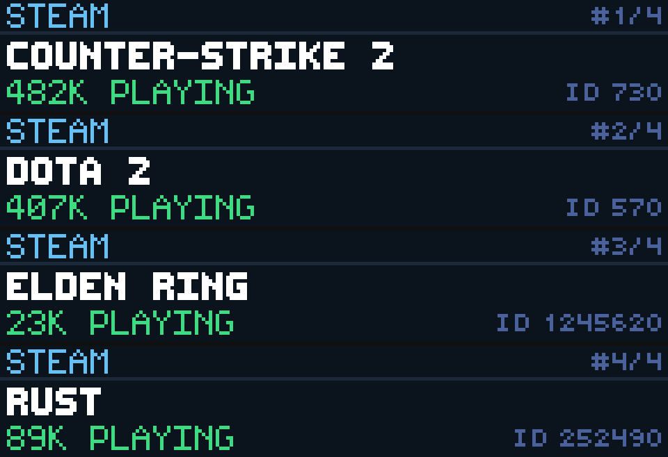

# Steam Players

Steam Players is a Glance Scroll Games app by reyos86. Type Steam AppIDs to track — live player count, review %, price/F2P, genre, and release year.



## Preview

```powershell
pip install -e .
gdn studio apps/steam-players
```

Or:

```powershell
gdn render apps/steam-players --input "game1=730" --input "game2=1245620"
gdn validate apps/steam-players
```

## Configuration

| Setting | Default | Notes |
|---------|---------|--------|
| **AppID 1** | `730` | Required for a single-game setup |
| **AppID 2** | `none` | Optional — leave as `none` if unused |
| **AppID 3** | `none` | Optional — leave as `none` if unused |
| **AppID 4** | `none` | Optional — leave as `none` if unused |

AppIDs come from the store URL: `store.steampowered.com/app/730/…`. Leave 2–4 as `none` to show only one game (single page — no empty frames). Multiple AppIDs rotate on each refresh.

## Layout

```text
STEAM [#n/t]              488K PLAYING
COUNTER-STRIKE 2
85%  F2P  ACTION  2012
```

## Data sources

- Players: `ISteamUserStats/GetNumberOfCurrentPlayers`
- Store card: `store.steampowered.com/api/appdetails`
- Reviews: `store.steampowered.com/appreviews/{id}`

Refresh **120s**. Player TTL ~3m; store/reviews ~24h.

## Known limitations

- Not SteamDB (no charts / price history / news)
- Multi-game rotation follows the refresh timer

Built for the [GLANCE Developer Network](https://github.com/glance-led-dev/glance-dev-network).
