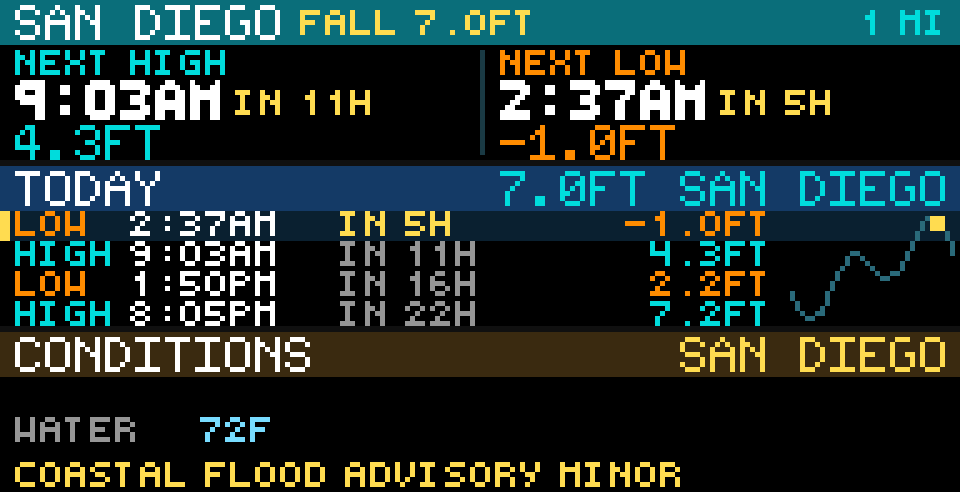

# Tide Chart

Tide Chart is a GLANCE weather/marine app by reyos86. It shows the next high and low tides, today’s tide schedule with a mini curve, live wind and water temperature when sensors exist, and National Weather Service alerts for a NOAA water-level station. No API key is required.



## Preview

From the GLANCE Developer Network repository:

```powershell
pip install -e .
gdn studio apps/tide-chart
```

The browser-only preview is also available with:

```powershell
gdn preview apps/tide-chart
```

If the `gdn` executable is not on `PATH`, use `python -m gdn.cli` in its place.

## Configuration

- **Zip code** — used only when Station ID is blank (default `92101`). Finds the nearest NOAA water-level station within **50 miles**.
- **Station ID** — optional NOAA station ID (for example `8467150`). When set, zip is ignored. Find IDs at [tidesandcurrents.noaa.gov](https://tidesandcurrents.noaa.gov/).

## Pages

| Page | Contents |
|------|----------|
| **tide** | Station name, optional rise/fall/steady with current height, distance or station ID, and **NEXT HIGH** / **NEXT LOW** (time, relative countdown/ago, height). |
| **today** | Up to four high/low rows for the day (next tide highlighted), current height when known, and a mini hourly tide curve with a now marker. |
| **conditions** | Wind (direction, speed, optional gust), water temperature, and an alert band (top NWS event, `ALL CLEAR`, or unavailable/no-sensors messages). |

Panel size is **192×32**. Refresh is **900 seconds** (predictions are relatively stable).

## Data sources

All keyless public APIs:

- **Zippopotam** — U.S. zip → latitude/longitude
- **NOAA MDAPI** — water-level station metadata and nearest-station search
- **NOAA CO-OPS datagetter** — high/low and hourly predictions (MLLW, english units), latest wind, latest water temperature
- **timeapi.io** — timezone offset for relative “in / ago” times
- **National Weather Service** — active alerts for the station point

## Display behavior

- Heights are in **feet (MLLW)**; water temperature in **°F**; wind in **mph**.
- Current height and trend come from today’s hourly prediction curve when available (`RISE` / `FALL` / `STEADY`).
- Relative times use forms like `IN 45m`, `IN 2h`, `30m AGO`.
- Station names are shortened and uppercased to fit the header.
- Alerts are ordered WARNING → ADVISORY → WATCH → other, with color by event/severity.
- Predictions cover today plus the next day for highs/lows; the hourly curve is for today.

## Errors and empty states

- No zip and no station → `NO LOCATION` / `SET ZIP OR STATION ID`
- Unknown zip → `BAD ZIP`
- Unknown station ID → `BAD STATION`
- NOAA list failure → `STATION ERROR`
- Nothing within 50 miles → `NO DATA AVAILABLE` / `NO STATION IN 50 MI`
- No astronomical predictions → `NO DATA AVAILABLE` / `NO TIDE PREDICTIONS` (zip path may try up to three nearest candidates)
- **today** with no rows → `NO TIDES TODAY`
- **conditions** without wind/water → `NO STATION SENSORS`; alert fetch failure → `ALERTS UNAVAILABLE`

Command-line example:

```powershell
gdn render apps/tide-chart --input "zip=92101"
gdn render apps/tide-chart --input "station=8467150"
gdn validate apps/tide-chart
```

## Current technical limitations

- U.S. zip codes only; search radius is 50 miles.
- Uses NOAA **water-level** stations; sites without astronomical tide predictions (for example some Great Lakes stations) are skipped.
- Not every station has wind or water-temperature sensors.
- Relative times depend on the timezone offset service (defaults to UTC offset 0 if that call fails).
- Frames are still images redrawn on the refresh timer; there is no animation.

Built for the [GLANCE Developer Network](https://github.com/glance-led-dev/glance-dev-network).
